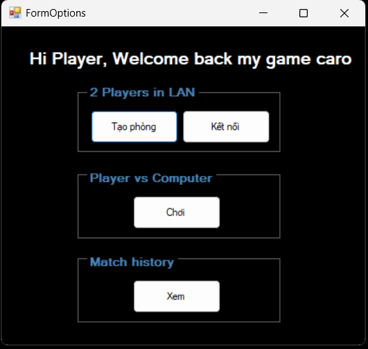
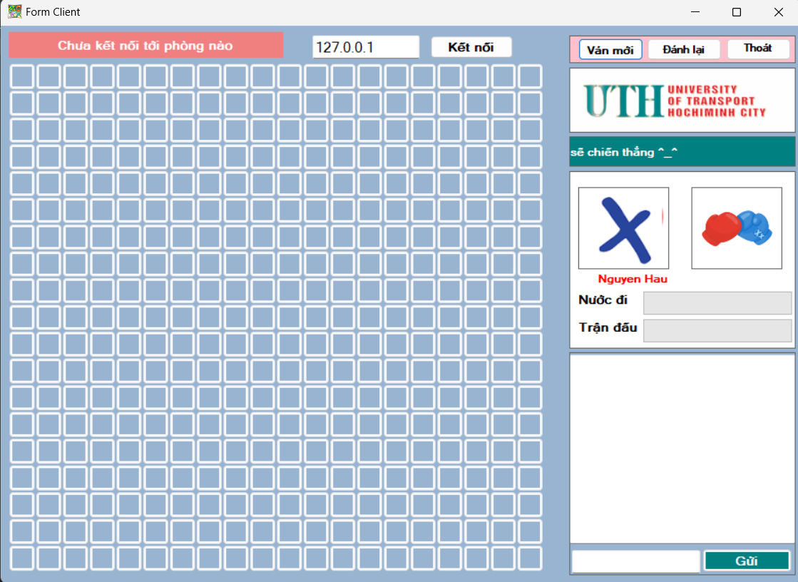
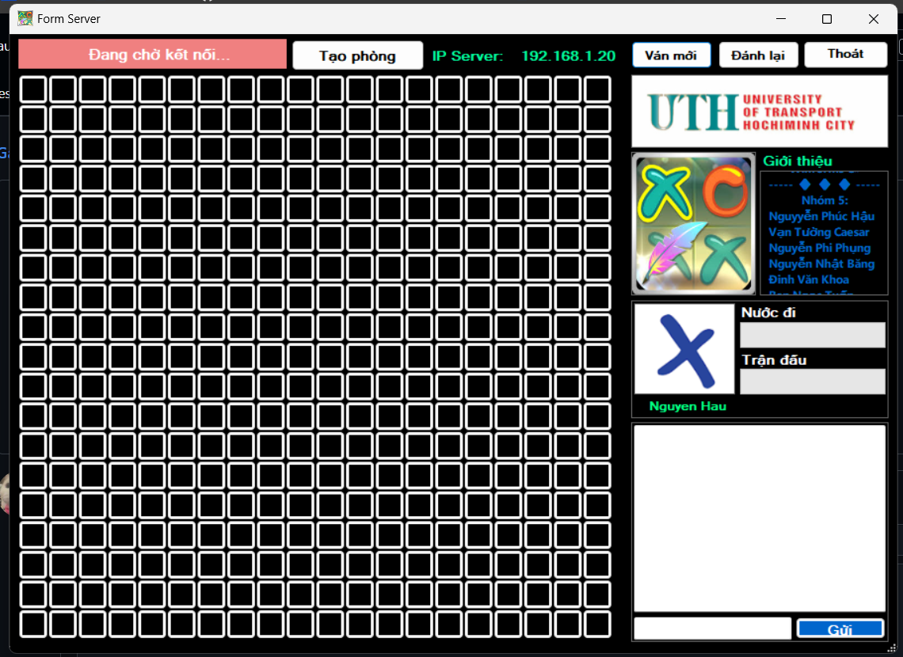
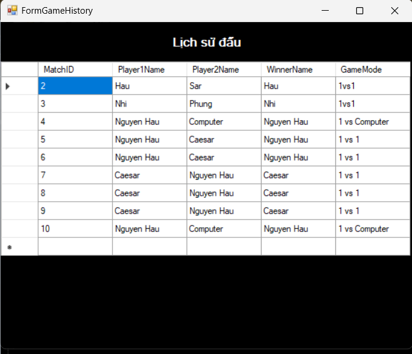

# Caro Game (Winforms C#)
## Introduce
The Caro Game project is a Tic-Tac-Toe-style game developed using Windows Forms in C#. The game allows players to compete against each other on the same computer, over a LAN, or against an AI. It also includes real-time chat functionality.


## Features
### Game Modes

- Player vs Player (on the same machine).
- Player vs Player (over LAN).
- Player vs AI (using Minimax or Alpha-Beta Pruning algorithms).

### Chat
- Integrated chat during LAN gameplay.

### Match Management
- View match history.


## Technologies Used

**Programming Language:** C#

**Development Environment:** Visual Studio

**SQL:** SQL Server

**Libraries and Tools:**
- System.Net.Sockets for LAN communication.
- Windows Forms for the user interface.


## Installation

### System Requirements:

- OS: Windows 7 or later.
- .NET Framework: 4.7.2 or higher.
- Visual Studio 2019/2022.

### Installation Steps:
- Clone the repository from GitHub:
```bash
  https://github.com/PhucHau0310/GameCaro.git
```
- Open the .sln file in Visual Studio.
- Build the project to install dependencies.
- Run the application.
    
## Screenshots










## Authors

- Name: Nguyễn Phúc Hậu
- Email: haunhpr024@gmail.com

